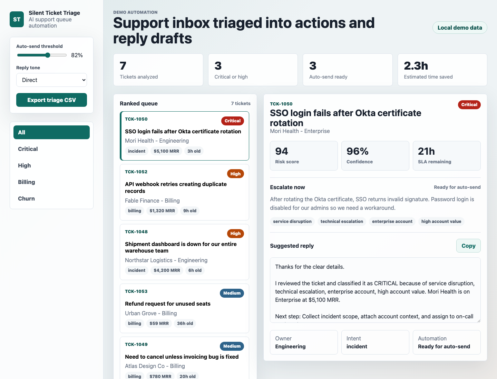

# Silent Ticket Triage

A small AI automation demo for support teams that need faster ticket triage. It ranks inbound tickets, identifies intent and account risk, routes each item to an owner, and generates a reply draft.

[Live demo](https://rabbit57.github.io/silent-ticket-triage/)



## Why this demo exists

This is designed as a portfolio-ready artifact for selling AI automation dashboard and workflow prototype work. It shows a buyer the result before any custom work starts:

- support tickets are scored by urgency and account value
- each ticket gets an intent, owner, risk signal list, and next action
- reply drafts can be changed by tone and copied
- the queue can be exported as CSV

The current implementation runs fully in the browser with deterministic sample data. In a paid client version, the scoring and draft generation layer can be replaced with an LLM call.

## Run locally

Open `index.html` directly in a browser, or serve the folder:

```bash
python3 -m http.server 4173
```

Then visit:

```text
http://localhost:4173
```

## Files

- `index.html`: app shell
- `src/app.js`: triage, scoring, routing, and reply generation logic
- `src/styles.css`: responsive UI
- `data/sample-tickets.csv`: sample exportable input data
- `screenshots/dashboard.png`: demo screenshot

## Customization ideas

- Replace `sampleTickets` with a CSV parser or helpdesk API sync.
- Swap `buildReply` with an OpenAI-compatible client.
- Add webhook delivery into Zendesk, Intercom, Help Scout, or Front.
- Persist reviewer corrections to improve future classification.
